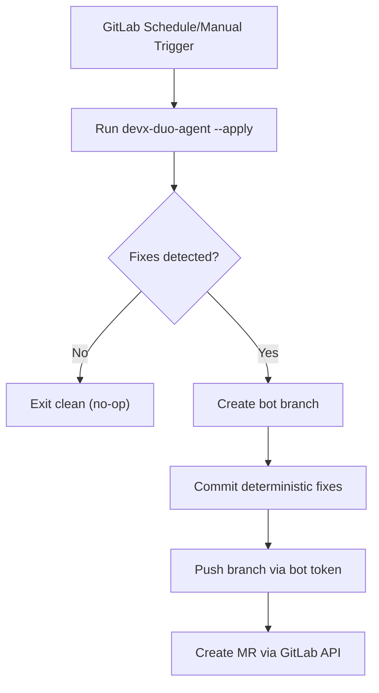
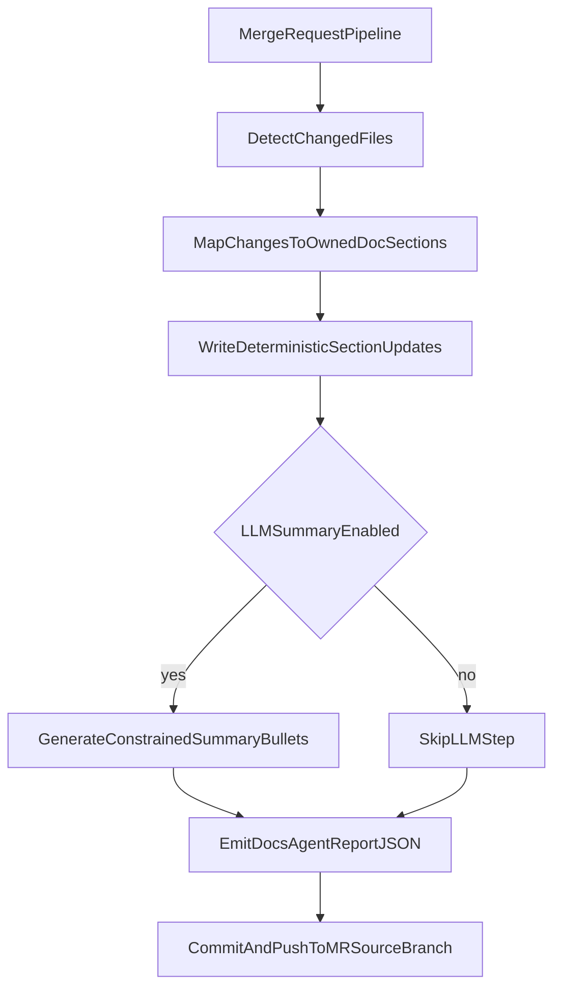

# GitLab Duo Agent MVP (Autonomous DevX Fixer)

## Problem this solves

Developers lose time cleaning noisy repo artifacts and accidental tracking drift:

- generated analyzer output files get committed by mistake
- local runtime data files show up in diffs
- CI/workflow files can churn in repos where automation billing is paused
- README and docs go stale relative to MR code changes

This causes failed pipelines, messy MRs, and wasted review cycles.

## MVP concept

An autonomous bot job runs on a GitLab schedule and:

1. scans for known hygiene drift
2. applies deterministic fixes
3. commits to a bot branch
4. opens a merge request automatically

No human prompt required.

A second autonomous job runs on **merge request pipelines** and:

1. detects changed code paths
2. maps changes to owned README/docs sections
3. applies deterministic section updates
4. optionally adds constrained LLM summary bullets
5. pushes docs changes back to the MR source branch

When enabled, the same docs job can also run on **push pipelines** and auto-open an MR if deleted code files are detected.

## Files added

- `.gitlab-ci.yml` - scheduled bot pipeline job
- `scripts/devx-duo-agent.mjs` - deterministic autofix engine
- `scripts/duo-agent.config.json` - repo-specific fix policy
- `scripts/devx-duo-docs-agent.mjs` - MR-triggered README/docs updater
- `scripts/duo-docs-agent.config.json` - docs ownership and mapping policy
- `scripts/prompts/docs-summary.md` - constrained optional LLM prompt template

## Execution flow





<!-- docs-agent:start:docs-agent-latest-impact -->
## Docs Agent Latest MR Impact (Auto-updated)

- Generated for ref: `pending`
- Diff source: `pending`
- Changed files detected: **0**
- Touched areas: none

#### Files in scope
- No changed files were detected.
<!-- docs-agent:end:docs-agent-latest-impact -->

## What it auto-fixes now

- Enforces ignore entries for local/generated files
- Untracks previously committed generated artifacts
- Untracks disabled GitHub workflow file(s) per policy
- Updates owned sections in `README.md` and hackathon docs from MR file diffs
- Writes machine-readable docs report artifact (`artifacts/docs-agent-report.json`)

## How to run locally (dry run)

```bash
node scripts/devx-duo-agent.mjs --check --config scripts/duo-agent.config.json
node scripts/devx-duo-docs-agent.mjs --check --config scripts/duo-docs-agent.config.json --changed-file apps/web/src/main.ts
```

Exit code `2` means autofixes are needed.

## How to run locally (apply fixes)

```bash
node scripts/devx-duo-agent.mjs --apply --config scripts/duo-agent.config.json
node scripts/devx-duo-docs-agent.mjs --apply --config scripts/duo-docs-agent.config.json --changed-file apps/web/src/main.ts
```

## 5-minute demo script (judge-friendly)

1. **Pain point setup (30s)**  
   Explain that generated analyzer files and ignore drift pollute diffs and break CI trust.
2. **Dry run (45s)**  
   Run `--check` and show JSON actions needed.
3. **Autofix (45s)**  
   Run `--apply` and show the actions were performed deterministically.
4. **Idempotence proof (30s)**  
   Run `--check` again and show no actions / clean result.
5. **Autonomy path (90s)**  
   Show `.gitlab-ci.yml` schedule rule + MR docs-agent rule + branch/commit/push flow.
6. **Safety controls (40s)**  
   Show policy file scope + `DUO_AGENT_DRY_RUN=1` + `DOCS_AGENT_DRY_RUN=1` + token gates.

## What judges should verify

- The agent is autonomous (schedule/manual trigger, no human instructions in run).
- The agent opens an MR rather than mutating default branch directly.
- The output is deterministic and policy-scoped.
- A second run is a no-op when repo is already compliant.
- Docs agent only edits marker-owned sections and is idempotent on repeat runs.

## GitLab setup

Create CI/CD variables in your GitLab project:

- `GITLAB_PUSH_TOKEN` - token allowed to push branches
- `GITLAB_API_TOKEN` - token allowed to create merge requests
- optional: `DUO_AGENT_GIT_EMAIL`
- optional: `DUO_AGENT_GIT_NAME`
- `DOCS_AGENT_PUSH_TOKEN` - token to push docs commits back to MR branch
- optional: `DOCS_AGENT_GIT_EMAIL`
- optional: `DOCS_AGENT_GIT_NAME`
- optional: `DOCS_AGENT_DRY_RUN=1`
- optional: `DOCS_AGENT_ENABLE_LLM=true` with:
  - `DOCS_AGENT_LLM_API_KEY`
  - optional `DOCS_AGENT_LLM_API_URL`
  - optional `DOCS_AGENT_LLM_MODEL`
- optional: `DOCS_AGENT_AUTO_OPEN_MR_ON_DELETION=1` (push pipelines)
- optional: `DOCS_AGENT_API_TOKEN` (or fallback `GITLAB_API_TOKEN`) to create MRs from push pipelines

Then create a pipeline schedule. The job runs when:

- `CI_PIPELINE_SOURCE == schedule`, or
- `RUN_DUO_AGENT == 1`
- If `DUO_AGENT_DRY_RUN == 1`, the job stops after commit creation and skips push/MR.

The docs job runs when:

- `CI_PIPELINE_SOURCE == merge_request_event`, or
- `CI_PIPELINE_SOURCE == push` and `DOCS_AGENT_AUTO_OPEN_MR_ON_DELETION == 1`, or
- `RUN_DOCS_AGENT == 1`

## Hackathon pitch angle

This is a "low-risk autonomous maintainer":

- deterministic changes
- scoped policy file
- automatic MR instead of force-push to default branch
- easy to review and extend with Duo reasoning tasks later

## Acceptance criteria

- Scheduled pipeline can run the agent unattended.
- Drift present: bot creates branch + commit + MR.
- No drift present: bot exits with no changes.
- `--check` is read-only and returns non-zero only when policy fixes are needed.
- `--apply` is idempotent (repeat run results in no additional changes).
- MR pipeline docs-agent updates only marker-owned README/docs sections.
- `artifacts/docs-agent-report.json` captures mapping, touched files, and LLM fallback state.
- Deleted code files produce follow-up suggestions in marker-owned sections and JSON report.
- Optional push-mode auto MR opens when deletion follow-ups are detected.

## Local prototype smoke test results

Executed in this repository with a simulated MR file change:

1. `node scripts/devx-duo-docs-agent.mjs --check --config scripts/duo-docs-agent.config.json --changed-file apps/web/src/main.ts`  
   Result: **exit 2** (updates detected for README + hackathon docs markers).
2. `node scripts/devx-duo-docs-agent.mjs --apply --config scripts/duo-docs-agent.config.json --changed-file apps/web/src/main.ts`  
   Result: **exit 0** (marker-owned sections updated, report written to `artifacts/docs-agent-report.json`).
3. Re-run step 1 with same input  
   Result: **exit 0** (idempotent; no additional changes required).

## Porting checklist (to hackathon repo)

1. Copy:
   - `.gitlab-ci.yml`
   - `scripts/devx-duo-agent.mjs`
   - `scripts/duo-agent.config.json`
   - `scripts/devx-duo-docs-agent.mjs`
   - `scripts/duo-docs-agent.config.json`
   - `scripts/prompts/docs-summary.md`
2. Ensure marker pairs exist in destination docs:
   - `<!-- docs-agent:start:... -->`
   - `<!-- docs-agent:end:... -->`
3. Update both config files for destination repository paths/policies.
4. Set CI variables:
   - `GITLAB_PUSH_TOKEN`
   - `GITLAB_API_TOKEN`
   - `DOCS_AGENT_PUSH_TOKEN`
5. Test with dry run flags first:
   - `DUO_AGENT_DRY_RUN=1`
   - `DOCS_AGENT_DRY_RUN=1`
6. Remove dry-run and validate end-to-end automation.

Detailed copy/substitution notes: `docs/hackathon/gitlab-duo-agent-port-bundle.md`.

## Next upgrade ideas

- Add secret leak remediation policy (auto-revoke + replace placeholders)
- Add stale-branch cleanup MR suggestions
- Add flaky test quarantine proposals (MR with rerun evidence)
- Add trust-intel retention summarization (compress long logs weekly)
