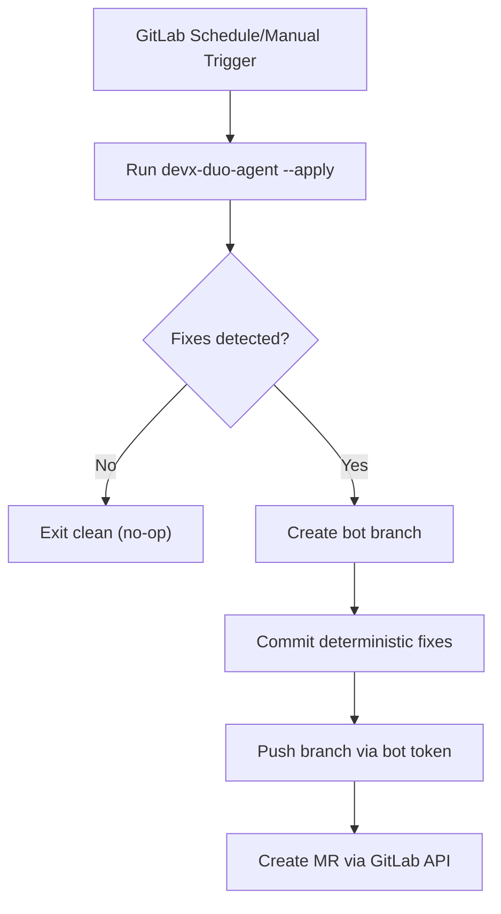

# GitLab Duo Agent MVP (Autonomous DevX Fixer)

## Problem this solves

Developers lose time cleaning noisy repo artifacts and accidental tracking drift:

- generated analyzer output files get committed by mistake
- local runtime data files show up in diffs
- CI/workflow files can churn in repos where automation billing is paused

This causes failed pipelines, messy MRs, and wasted review cycles.

## MVP concept

An autonomous bot job runs on a GitLab schedule and:

1. scans for known hygiene drift
2. applies deterministic fixes
3. commits to a bot branch
4. opens a merge request automatically

No human prompt required.

## Files added

- `.gitlab-ci.yml` - scheduled bot pipeline job
- `scripts/devx-duo-agent.mjs` - deterministic autofix engine
- `scripts/duo-agent.config.json` - repo-specific fix policy

## Execution flow



## What it auto-fixes now

- Enforces ignore entries for local/generated files
- Untracks previously committed generated artifacts
- Untracks disabled GitHub workflow file(s) per policy

## How to run locally (dry run)

```bash
node scripts/devx-duo-agent.mjs --check --config scripts/duo-agent.config.json
```

Exit code `2` means autofixes are needed.

## How to run locally (apply fixes)

```bash
node scripts/devx-duo-agent.mjs --apply --config scripts/duo-agent.config.json
```

## 5-minute demo script (judge-friendly)

1. **Pain point setup (30s)**  
   Explain that generated analyzer files and ignore drift pollute diffs and break CI trust.
2. **Dry run (45s)**  
   Run `--check` and show JSON actions needed.
3. **Autofix (45s)**  
   Run `--apply` and show the actions were performed deterministically.
4. **Idempotence proof (30s)**  
   Run `--check` again and show no actions / clean result.
5. **Autonomy path (90s)**  
   Show `.gitlab-ci.yml` schedule rule + branch/commit/push/MR flow.
6. **Safety controls (40s)**  
   Show policy file scope + `DUO_AGENT_DRY_RUN=1` + required token gate.

## What judges should verify

- The agent is autonomous (schedule/manual trigger, no human instructions in run).
- The agent opens an MR rather than mutating default branch directly.
- The output is deterministic and policy-scoped.
- A second run is a no-op when repo is already compliant.

## GitLab setup

Create CI/CD variables in your GitLab project:

- `GITLAB_PUSH_TOKEN` - token allowed to push branches
- `GITLAB_API_TOKEN` - token allowed to create merge requests
- optional: `DUO_AGENT_GIT_EMAIL`
- optional: `DUO_AGENT_GIT_NAME`

Then create a pipeline schedule. The job runs when:

- `CI_PIPELINE_SOURCE == schedule`, or
- `RUN_DUO_AGENT == 1`
- If `DUO_AGENT_DRY_RUN == 1`, the job stops after commit creation and skips push/MR.

## Hackathon pitch angle

This is a "low-risk autonomous maintainer":

- deterministic changes
- scoped policy file
- automatic MR instead of force-push to default branch
- easy to review and extend with Duo reasoning tasks later

## Acceptance criteria

- Scheduled pipeline can run the agent unattended.
- Drift present: bot creates branch + commit + MR.
- No drift present: bot exits with no changes.
- `--check` is read-only and returns non-zero only when policy fixes are needed.
- `--apply` is idempotent (repeat run results in no additional changes).

## Porting checklist (to hackathon repo)

1. Copy:
   - `.gitlab-ci.yml`
   - `scripts/devx-duo-agent.mjs`
   - `scripts/duo-agent.config.json`
2. Update `scripts/duo-agent.config.json` file paths for that repo’s generated artifacts.
3. Set CI variables:
   - `GITLAB_PUSH_TOKEN`
   - `GITLAB_API_TOKEN`
4. Create schedule in GitLab and run once with `DUO_AGENT_DRY_RUN=1`.
5. Remove dry-run and validate end-to-end MR creation.

Detailed copy/substitution notes: `docs/hackathon/gitlab-duo-agent-port-bundle.md`.

## Next upgrade ideas

- Add secret leak remediation policy (auto-revoke + replace placeholders)
- Add stale-branch cleanup MR suggestions
- Add flaky test quarantine proposals (MR with rerun evidence)
- Add trust-intel retention summarization (compress long logs weekly)
