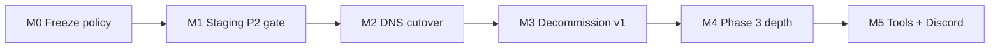

# Launch & Cutover Plan — B+D Strategy (v1 freeze + MVP forward build)

**Date:** 2026-06-17  
**Status:** Approved  
**Strategy:** **B** (staging gate before DNS) + **D** (solo bandwidth — v1 ops-only, MVP owns product)  
**Related:** [hybrid-v1-mvp-strategy.md](../../ai/hybrid-v1-mvp-strategy.md), [LAUNCH-CHECKLIST.md](../../LAUNCH-CHECKLIST.md), MVP [phases.md](../../../tiltcheckmvp/docs/phases.md), [manual-tasks.md](../../../tiltcheckmvp/docs/manual-tasks.md)

---

## 1. Decision summary

| Choice | What it means |
|--------|----------------|
| **Two repos until M3** | `TiltCheck-ME/tiltcheck-monorepo` (v1) stays live for crawler, legacy bots, and prod API until cutover. `jmenichole/tiltcheckmvp` (MVP) is the forward build. |
| **v1 freeze (M0)** | No new product features on v1. Only P0 ops: secrets, ingest auth, crawler runs, hotfixes. |
| **MVP owns product** | Bonuses feed, sitemap/SEO, Degen Copilot, dashboard depth — all land on MVP post-M2 unless explicitly bridged on v1. |
| **Staging gate (M1)** | Production DNS does **not** move until Phase 2 protected-session loop passes on staging (login → vault → enforcement). |
| **Archive v1 (M3)** | After DNS stable + email-ingest on MVP, mark v1 monorepo read-only. |

**Rejected for now:** Full v1 fleet repair, duplicate feature ports, DNS-first cutover without enforcement sign-off.

---

## 2. North-star KPI

**Protected sessions per week**

An authenticated user with an **enabled `session_cap`** vault rule where **enforcement fired at least once** in the rolling 7-day window.

| Field | Definition |
|-------|------------|
| Numerator | Distinct `userId` with ≥1 enforcement event (Touch Grass overlay + betting block) in last 7d |
| Denominator (optional) | Distinct authed users with enabled `session_cap` |
| Source | Extension telemetry → API (post-cutover); staging manual count until prod |

**Why:** Marketing and trust pages are vanity without proof the protector actually fires. This KPI ties launch success to the core loop.

---

## 3. Supporting KPIs (weekly)

Track in [metrics-weekly.md](../../metrics-weekly.md).

| KPI | Target (early) | Notes |
|-----|----------------|-------|
| Extension installs (store) | Baseline + trend | Chrome Web Store analytics |
| Discord OAuth completions | ↑ week over week | `POST /auth/discord/callback` success |
| Vault rules saved | ≥1 per new authed user | `POST /vault` with non-stub payload |
| Enforcement events | ≥1 per protected session user | SW log + optional API ping |
| `/casinos` → install CTR | Measure, optimize later | UTM on extension CTA |
| Bonus feed freshness | <24h lag on top picks | v1 upstream until M3 ingest |
| Staging gate | Binary pass/fail | M1 blocker |

---

## 4. Milestones M0–M5

### M0 — Freeze policy (now)

**Exit criteria:**
- [ ] Team agrees: v1 = ops only; MVP = product
- [ ] Open v1 PRs triaged (see §6)
- [ ] MVP local branches pushed by owner (`cursor[bot]` cannot push to `jmenichole/tiltcheckmvp`)
- [ ] Prod secrets verified on v1 API: `EMAIL_INGEST_SECRET`, `INTERNAL_SERVICE_TOKEN` (post-#591)

**Owner actions:** [LAUNCH-CHECKLIST.md § M0](../../LAUNCH-CHECKLIST.md)

---

### M1 — Staging Phase 2 gate (blocks cutover)

**Exit criteria:** All items in [cutover-checklist.md](../../../tiltcheckmvp/docs/cutover-checklist.md) Phase 2 section green on staging.

Minimum path:
1. Extension staging build → staging API
2. Discord login (web or ext)
3. Save `session_cap` in dashboard vault
4. Test casino → critical tilt → Touch Grass overlay → betting blocked until timer ends
5. `pnpm test:e2e` green on MVP `main`

**Reference:** [manual-tasks.md § H–I](../../../tiltcheckmvp/docs/manual-tasks.md), [real-accounts-signoff.md](../../../tiltcheckmvp/docs/superpowers/reports/2026-05-27-real-accounts-signoff.md)

---

### M2 — DNS cutover

**Exit criteria:**
- [ ] M1 signed off
- [ ] Production Supabase migrated + seeded
- [ ] Production Railway env vars match custom hostnames
- [ ] DNS: `tiltcheck.me`, `api.tiltcheck.me` → MVP Railway
- [ ] `dashboard.tiltcheck.me` → 301 → `https://tiltcheck.me/dashboard`
- [ ] Chrome Web Store extension update → `EXTENSION_API_URL=https://api.tiltcheck.me`
- [ ] Prod smoke: login + vault + one enforcement test

**Rollback:** Revert DNS to v1 Railway services; keep v1 crawler on `api.tiltcheck.me` until re-pointed.

---

### M3 — Decommission v1

**Exit criteria:**
- [ ] MVP ships `POST /rgaas/email-ingest` (see execution plan Task 4)
- [ ] Crawler `CRAWLER_API_URL` pointed at MVP API; backlog drained if needed
- [ ] v1 monorepo archived read-only on GitHub
- [ ] Close or merge remaining v1 product PRs; document final state

**Until M3:** v2 `/bonuses` may use `BONUSES_UPSTREAM_URL=https://api.tiltcheck.me/bonuses`.

---

### M4 — Phase 3 dashboard depth (post-cutover)

Ship in order per [phases.md](../../../tiltcheckmvp/docs/phases.md):

1. Analytics tab
2. Buddies (simplified)
3. Dashboard Bonuses tab (full inbox; public `/bonuses` already partial)

**Also M4:** Degen Copilot implementation per [2026-06-17-degen-copilot-design.md](./2026-06-17-degen-copilot-design.md) — configure + compose on extension, Discord, web.

---

### M5 — Phase 4–5 tools + Discord

1. Tools: session-stats → verify → house-edge (one page + one API module each)
2. Discord bot on Railway (`/vault status`, alert webhook)
3. Retire v1 discord-bot when v2 commands verified

---

## 5. Repo responsibilities

| Surface | Until M2 | After M2 |
|---------|----------|----------|
| Marketing web | v1 prod OR MVP staging | MVP prod |
| API | v1 `api.tiltcheck.me` | MVP API |
| Extension (store) | Legacy v1 build | MVP build |
| Email crawler | v1 monorepo | MVP after M3 ingest |
| Discord bots | v1 Railway | MVP `apps/discord` |
| Supabase | v1 + MVP staging separate | MVP prod only for vault |

---

## 6. Open PR disposition (v1 monorepo)

| PR | Recommendation | Rationale |
|----|----------------|-----------|
| **#591** | Merged | P0 security + fleet docs |
| **#594** | Merged | Degen Copilot design spec |
| **#596** | Merge optional | Sitemap, `/site-map`, 404 — low-risk marketing SEO on v1 until cutover |
| **#590** | Close or short bridge | MVP owns bonuses long-term; avoid duplicate maintenance |
| **#595** | Merge doc-only | Copilot spec review fixes; no v1 implementation |

New launch docs: branch `cursor/launch-cutover-plan-ec58`.

---

## 7. MVP branches awaiting owner push

`cursor[bot]` gets **403** on `jmenichole/tiltcheckmvp`. Push from an account with write access:

| Branch | Contents | Verify |
|--------|----------|--------|
| `cursor/daily-bonus-feed-port-ec58` | `GET /bonuses/daily-feed` + `/bonuses` | `pnpm build` |
| `cursor/web-sitemap-ec58` | sitemap, robots, `/site-map`, 404 | `pnpm -C apps/web dev` |

Local clone: `/workspace/tiltcheckmvp` (or fresh clone on your machine).

---

## 8. Risk notes

| Risk | Mitigation |
|------|------------|
| Cutover without enforcement sign-off | M1 gate is hard blocker in checklist |
| Email ingest gap during M2–M3 | Keep crawler on v1; proxy bonuses via `BONUSES_UPSTREAM_URL` |
| User vault data loss | Users re-login at cutover; vault in new Supabase by design |
| Solo bandwidth | v1 frozen; defer fleet repair and Phase 4–5 until M4 stable |
| Extension store review delay | Ship staging unpacked build for gate; store update parallel to M2 prep |

---

## 9. Document map

| Doc | Purpose |
|-----|---------|
| [LAUNCH-CHECKLIST.md](../../LAUNCH-CHECKLIST.md) | Step-by-step operator checklist (you follow this) |
| [2026-06-17-launch-cutover-execution.md](../plans/2026-06-17-launch-cutover-execution.md) | Agent/engineering task breakdown |
| [metrics-weekly.md](../../metrics-weekly.md) | Weekly KPI worksheet |
| MVP [manual-tasks.md](../../../tiltcheckmvp/docs/manual-tasks.md) | Supabase, Railway, Discord, DNS detail |
| MVP [cutover-checklist.md](../../../tiltcheckmvp/docs/cutover-checklist.md) | Smoke tests + enforcement definition |

---

**Next step for operator:** Open [LAUNCH-CHECKLIST.md](../../LAUNCH-CHECKLIST.md) and start at M0.
