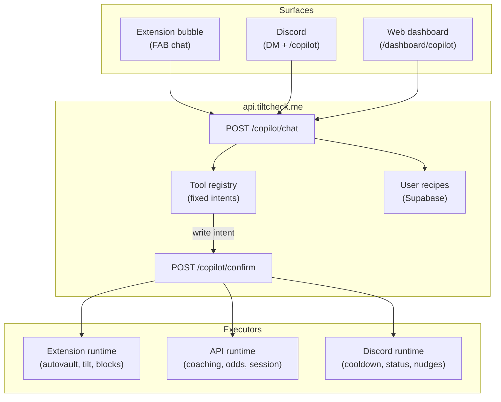

# Degen Copilot — Configure & Compose on All Surfaces (Design Spec)

**Date:** 2026-06-17  
**Status:** Approved (brainstorming gate passed)  
**Next step:** Implementation plan via writing-plans skill  
**Related:** [hybrid-v1-mvp-strategy.md](../../ai/hybrid-v1-mvp-strategy.md), MVP [extension-autovault-scope.md](../../../tiltcheckmvp/docs/superpowers/specs/2026-05-27-extension-autovault-scope.md), [intel-agent API](../../api/intel-agent.md)

---

## 1. Problem & goal

**Problem:** TiltCheck has strong fixed tools (DIA, autovault, tilt detector, Discord session commands, Intel chat) but no unified conversational layer. Users cannot describe guardrails in plain language and have them applied consistently. NL paths are fragmented: Discord NLP suggests slash commands without executing; AI Gateway `nl-commands` is barely wired; Intel chat is read-only trust Q&A; the extension has no chat agent.

**Goal:** A **Degen Copilot** chat experience on **extension, Discord, and web dashboard** that turns natural language into **configured automations and coaching** using a fixed, audited tool registry — not runtime code generation.

**Non-goals:**
- LLM-generated content scripts or arbitrary casino DOM automation
- Server-side balance polling (no access to casino sessions)
- Custodial vault or TiltCheck-held funds
- "Perfect dice strategy" optimizers that imply positive EV
- Auto-execute write operations without user confirm

**North-star metric:** **Confirmed guardrails per active user per week** — write intents that pass preview and receive explicit confirm, then run on the correct execution plane.

---

## 2. Approach decision

Three models were evaluated:

| Model | Description | Verdict |
|-------|-------------|---------|
| **A — Configure** | NL fills params on known tools; preview + confirm | **Ship Phase 1** |
| **B — Compose** | Chain registry intents into named saved recipes | **Ship Phase 2** |
| **C — Generate** | LLM writes new executable logic per request | **Rejected** — trust, security, DOM brittleness |

**Approved model:** A + B. User-facing copy may say "built for you"; implementation is registry lookup + slot filling + optional recipe persistence.

---

## 3. Architecture

### 3.1 System map



### 3.2 Execution routing rule

**Unified chat, routed execution.** All surfaces call the same API and render the same structured response blocks. Execution location depends on capability, not on where the user typed.

| Capability | Configure from | Execute on |
|------------|----------------|------------|
| Tilt coaching, session review | All surfaces | API (read-only) |
| Odds / dice advisory | All surfaces | API (read-only) |
| Autovault percent, poll interval | All surfaces | **Extension only** |
| Game block, session cap | All surfaces | Extension + Discord where applicable |
| Saved recipes | All surfaces | Sync via API; extension pulls on auth connect |

**Control plane vs execution plane:** Web and Discord configure and confirm. Extension runs DOM/casino automation (autovault, balance observers). API runs read-only analytics and advisory.

### 3.3 Example flow — "vault 10% of each win, check balance every 10s"

1. User sends message on Discord (or web or extension).
2. API parses intent `vault.configure` with `{ percent: 10, trigger: "on_win", pollMs: 10000, sites: ["stake.us"] }`.
3. API returns `config_preview` block + single-use `confirmToken` (5 min TTL).
4. User confirms on any surface.
5. Config persisted to Supabase; extension sync pulls config on next connect or via push handoff.
6. Existing autovault module applies on casino tab — no new vault engine generated.

---

## 4. Tool registry (Phase 1)

Fixed intents. NL maps to `{ intent, parameters, confidence }`. Low confidence returns clarifying question, not a guess.

| Intent ID | User examples | Parameters | Write |
|-----------|---------------|------------|-------|
| `tilt.coach` | "recognize my tilt patterns" | `lookbackDays`, `focus?` | No |
| `session.review` | "how'd my last session go" | `sessionId?` | No |
| `dice.advise` | "perfect my dice strategy" | `site?`, `bankroll?` | No |
| `odds.lookup` | "house edge on plinko" | `game`, `site?` | No |
| `vault.configure` | "vault 10% of each win" | `percent`, `trigger`, `pollMs`, `sites[]`, `enabled` | Yes |
| `cooldown.set` | "lock me out 30 min after 3 losses" | `losses`, `minutes` | Yes |
| `game.block` | "block dice when I'm tilting" | `games[]`, `mode` | Yes |
| `recipe.save` | "call this my rinse guard" | `name`, `steps[]` | Yes |

### 4.1 NL pipeline

1. Primary: AI Gateway / `packages/ai-client` structured output → intent + slots.
2. Fallback: `packages/natural-language-parser` for amounts, durations, vault phrasing.
3. Threshold: if `confidence < 0.7`, return clarifying `text` block with suggested replies.

### 4.2 Phase 2 — Compose

Intent `recipe.compose` chains registry steps into `UserRecipe` JSON. Steps reference intent IDs and params only — never arbitrary code.

---

## 5. Response blocks (all surfaces)

Reuse Intel chat structured JSON pattern. Extend block types:

| Block type | Purpose |
|------------|---------|
| `text` | Coaching / advisory copy (degen tone) |
| `metric_card` | Tilt stats, session PnL, streaks |
| `config_preview` | Autovault, cooldown, game block before confirm |
| `confirm_action` | Confirm / Reject + `confirmToken` |
| `login_prompt` | Personal tools require Discord auth |
| `extension_required` | Vault/balance tools need connected extension |
| `clarify` | Multiple-choice or free-text follow-up for low confidence |

**No LLM-generated HTML.** Renderers per surface map blocks to native UI (extension sidebar, Discord embeds + buttons, web React components).

---

## 6. Surface UX

### 6.1 Extension (FAB chat bubble)

- Chat bubble on existing FAB; collapses to activity feed when idle.
- Write confirms apply to `chrome.storage` and sync upstream.
- Live status line: "Vault skim active — 10% on win, last check 8s ago."
- Offline: queue pending config; apply when casino tab active.

### 6.2 Discord

- Entry: `@TiltCheck copilot …` or `/copilot` with optional message argument.
- Write previews: ephemeral messages with Confirm/Reject interaction buttons.
- Read-only coaching allowed in threads; vault/bankroll config in DM or ephemeral only.
- Upgrade from current `nlp-intent.ts` suggest-only behavior to API-backed execute-after-confirm.

### 6.3 Web dashboard (`/dashboard/copilot`)

- Full chat panel plus recipe library sidebar.
- Recipe edit as form fields (not raw JSON for default UX).
- "Push to extension" when `extension_required` block returned.
- History: past coaching sessions and confirmed automations.

---

## 7. Safety, auth, non-custodial

| Gate | Rule |
|------|------|
| Auth | Anonymous: read-only intents, 20 req/hr IP limit. Authed: personal tilt/vault/recipes, 60 req/hr. |
| Write confirm | Every write returns preview; `confirmToken` single-use, 5 min TTL; no auto-execute. |
| Extension handoff | Vault/balance intents return `extension_required` if extension not linked. |
| Non-custodial | Copilot never holds funds; autovault uses casino-native vault UI same as existing module. |
| Dice advisory | Copy states negative EV; recommends bankroll discipline and stop rules, not edge claims. |
| Audit log | `intent`, `params` (redacted), `surface`, `discordId`, `confirmedAt` — no casino credentials or raw balances. |
| Rollback | `vault.configure` with `enabled: false` uses same confirm flow. |

**Threat notes:**
- Confirm token theft: bind to `discordId` + surface session; short TTL.
- Prompt injection: registry allowlist only; LLM cannot invoke unlisted intents.
- Impersonation: all personal reads/writes require authenticated `discordId` from session, never from client body alone.

---

## 8. Data model

### 8.1 UserRecipe (Supabase)

```typescript
interface UserRecipe {
  id: string;
  discordId: string;
  name: string; // e.g. "rinse guard"
  steps: Array<{ intent: string; params: Record<string, unknown> }>;
  enabled: boolean;
  createdAt: string;
  updatedAt: string;
}
```

### 8.2 PendingConfirm (Redis or Supabase, TTL 5 min)

```typescript
interface PendingConfirm {
  confirmToken: string;
  discordId: string;
  intent: string;
  params: Record<string, unknown>;
  requestedFrom: "discord" | "web" | "extension";
  expiresAt: string;
  consumed: boolean;
}
```

### 8.3 Extension sync

On Discord auth connect: pull `UserRecipe[]` and active vault config from API. Dashboard or Discord edits propagate within one sync cycle. Conflict rule: latest `updatedAt` wins; extension shows diff if local unsynced changes exist.

---

## 9. API endpoints

| Method | Path | Auth | Description |
|--------|------|------|-------------|
| POST | `/copilot/chat` | flexAuth (optional) | Message in → blocks out |
| POST | `/copilot/confirm` | required | Consume token; route to executor |
| GET | `/copilot/recipes` | required | List user recipes |
| PUT | `/copilot/recipes/:id` | required | Update recipe |
| DELETE | `/copilot/recipes/:id` | required | Delete recipe |

Reuse existing `flexAuth`, AI Gateway rate limits, and Intel chat patterns where applicable.

---

## 10. Reuse map (existing code)

| New copilot piece | Reuse from |
|-------------------|------------|
| Intent router | `packages/ai-client`, `apps/api/src/routes/ai-gateway.ts` |
| Vault slot parsing | `packages/natural-language-parser` |
| Coaching data | DIA tools (`get_trust_standing`, `get_user_analytics`), tilt DB |
| Block rendering (web) | `IntelBlockRenderer` pattern |
| Discord NL entry | `apps/discord-bot/src/services/nlp-intent.ts` (upgrade to execute) |
| Autovault execution | Extension autovault module (MVP + v1 extension) |
| Session/cooldown | Discord `session.ts`, tilt detector |

---

## 11. Testing & acceptance criteria

### 11.1 Phase 1 ship criteria

- [ ] Same NL input produces identical preview blocks on extension, Discord, and web.
- [ ] Vault configure from Discord → confirm on web → extension applies on stake.us test tab.
- [ ] Tilt coach returns session data for authed user; `login_prompt` for anonymous.
- [ ] No write executes without confirm on all three surfaces.
- [ ] Dice advisory never implies positive EV.
- [ ] Confirm token expires after 5 min and is single-use.
- [ ] Audit log entries created for confirmed writes without sensitive data.

### 11.2 Test types

- Unit: intent router, slot extraction, confirm token lifecycle.
- Integration: cross-surface confirm flow, extension sync pull.
- Manual: FAB chat on stake.us, Discord ephemeral confirm, dashboard recipe edit.

### 11.3 Success metrics (90 days post-launch)

| Metric | Target |
|--------|--------|
| Write preview → confirm rate | > 40% |
| Recipe re-enable rate | Track baseline |
| Tilt coach → vault/cooldown funnel | Track baseline |
| `extension_required` handoff completion | > 60% |

---

## 12. Phased delivery

| Phase | Scope |
|-------|-------|
| **Phase 1** | Registry intents (8), `/copilot/chat` + `/copilot/confirm`, all three surfaces, configure-only |
| **Phase 2** | `recipe.compose`, recipe library UI, cross-surface sync polish |
| **Phase 3** | Proactive nudges (DIA `generate_nudge`), recipe suggestions from tilt patterns |

**Primary build target:** `jmenichole/tiltcheckmvp` per hybrid strategy. Port patterns from v1 DIA/Intel where stable.

---

## 13. Open decisions (resolved)

| Question | Decision |
|----------|----------|
| Configure vs generate? | Configure + compose only |
| Surfaces day one? | Extension + Discord + web dashboard |
| Execution for vault? | Extension only; other surfaces are control planes |

---

**Made for Degens. By Degens.**
