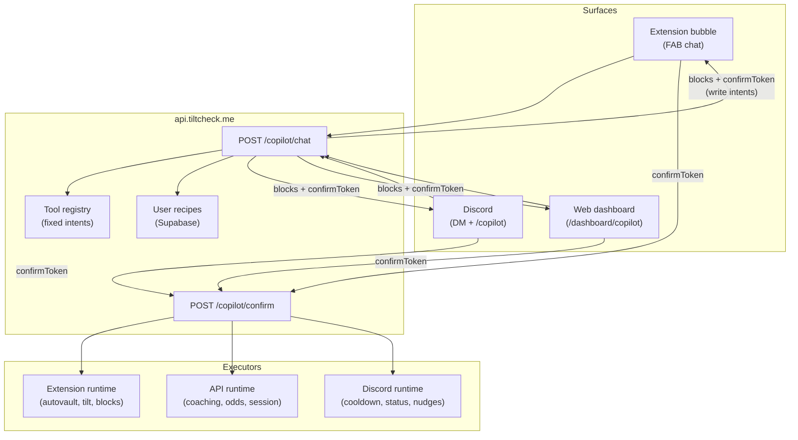

<!-- © 2024–2026 TiltCheck Ecosystem. All Rights Reserved. Last Updated: 2026-06-17 -->

# Degen Copilot — Configure & Compose on All Surfaces (Design Spec)

**Date:** 2026-06-17  
**Status:** Approved (brainstorming gate passed; PR #594 review feedback incorporated)  
**Next step:** Implementation plan via writing-plans skill  
**Related:** [hybrid-v1-mvp-strategy.md](../../ai/hybrid-v1-mvp-strategy.md), MVP [extension-autovault-scope.md](../../../tiltcheckmvp/docs/superpowers/specs/2026-05-27-extension-autovault-scope.md), [intel-agent API](../../api/intel-agent.md)

---

## 1. Problem & goal

**Problem:** TiltCheck has strong fixed tools (DIA, autovault, tilt detector, Discord session commands, Intel chat) but no unified conversational layer. Users cannot describe guardrails in plain language and have them applied consistently. NL paths are fragmented: Discord NLP suggests slash commands without executing; AI Gateway `nl-commands` is barely wired; Intel chat is read-only trust Q&A; the extension has no chat agent.

**Goal:** A **Degen Copilot** chat experience on **extension, Discord, and web dashboard** that turns natural language into **configured automations and coaching** using a fixed, audited tool registry — not runtime code generation.

**Non-goals:**
- LLM-generated content scripts or arbitrary casino DOM automation
- Server-side balance polling (no access to casino sessions)
- Custodial vault or TiltCheck-held funds
- "Perfect dice strategy" optimizers that imply positive EV
- Auto-execute write operations without user confirm

**North-star metric:** **Confirmed guardrails per active user per week** — write intents that pass preview and receive explicit confirm, then run on the correct execution plane.

---

## 2. Approach decision

Three models were evaluated:

| Model | Description | Verdict |
|-------|-------------|---------|
| **A — Configure** | NL fills params on known tools; preview + confirm | **Ship Phase 1** |
| **B — Compose** | Chain registry intents into named saved recipes | **Ship Phase 2** |
| **C — Generate** | LLM writes new executable logic per request | **Rejected** — trust, security, DOM brittleness |

**Approved model:** A + B. User-facing copy may say "built for you"; implementation is registry lookup + slot filling + optional recipe persistence.

---

## 3. Architecture

### 3.1 System map



**Flow notes:**
- `/copilot/chat` never executes writes. It returns structured blocks; write intents include a `confirm_action` block with `confirmToken`.
- Surfaces invoke `/copilot/confirm` only after explicit user action (button tap).
- Executors run server-side or client-side only after confirm succeeds.

### 3.2 Execution routing rule

**Unified chat, routed execution.** All surfaces call the same API and render the same structured response blocks. Execution location depends on capability, not on where the user typed.

| Capability | Configure from | Execute on |
|------------|----------------|------------|
| Tilt coaching, session review | All surfaces | API (read-only) |
| Odds / dice advisory | All surfaces | API (read-only) |
| Autovault save amount, check interval | All surfaces | **Extension only** |
| Game block, session cap | All surfaces | Extension + Discord where applicable |
| Saved recipes | All surfaces | Sync via API; extension pulls on auth connect |

**Control plane vs execution plane:** Web and Discord configure and confirm. Extension runs DOM/casino automation (autovault, balance observers). API runs read-only analytics and advisory.

### 3.3 Example flow — "vault 10% of each win, check balance every 10s"

1. User sends message on Discord (or web or extension).
2. API parses intent `vault.configure`. NL slot-filler maps user phrasing to **`AutoVaultConfig`** fields (see Section 4.3):
   - `"10% of each win"` → `saveAmount: 0.1`
   - `"every 10 seconds"` → `checkInterval: 10`
3. API returns `config_preview` block (human-readable summary) + `confirm_action` block with single-use `confirmToken` (5 min TTL).
4. User confirms on **any** authenticated surface (Discord button, web Confirm, or extension Confirm).
5. Config persisted to Supabase keyed by `userId`; extension sync pulls config on next connect or via push handoff.
6. Existing autovault module writes `AutoVaultConfig` to `chrome.storage` and applies on the active casino tab. Site selection is **not** a config field — the engine auto-detects stake.us vs nuts.gg from hostname (see `apps/extension/src/autovault/` and v1 `apps/chrome-extension/src/autovault.ts`).

### 3.4 Cross-surface confirm handoff

Users may start a write on one surface and confirm on another. All surfaces share the same `confirmToken` scoped to `userId`.

| Origin surface | Handoff mechanism |
|----------------|-------------------|
| **Discord** | Ephemeral message with **Confirm here** (interaction → `POST /copilot/confirm`) and **Confirm on web** button linking to `{WEB_ORIGIN}/dashboard/copilot?confirm=:confirmToken` |
| **Web** | In-panel Confirm button; pending confirms also listed at `/dashboard/copilot/pending` for the logged-in user |
| **Extension** | FAB chat Confirm button; optional **Open in dashboard** deep link with same `?confirm=` query param |

**Deep link contract:**
- URL: `/dashboard/copilot?confirm=:confirmToken`
- Web app loads preview via `GET /copilot/pending/:confirmToken` (authed; token must belong to session `userId`)
- User clicks Confirm → `POST /copilot/confirm` → redirect to success state

**Security:** Token is useless without authenticated session matching `PendingConfirm.userId`. Tokens are single-use and expire in 5 minutes regardless of surface.

---

## 4. Tool registry (Phase 1)

Fixed intents. NL maps to `{ intent, parameters, confidence }`. Low confidence returns clarifying question, not a guess.

| Intent ID | User examples | Parameters | Write |
|-----------|---------------|------------|-------|
| `tilt.coach` | "recognize my tilt patterns" | `lookbackDays`, `focus?` | No |
| `session.review` | "how'd my last session go" | `sessionId?` | No |
| `dice.advise` | "perfect my dice strategy" | `site?`, `bankroll?` | No |
| `odds.lookup` | "house edge on plinko" | `game`, `site?` | No |
| `vault.configure` | "vault 10% of each win" | `saveAmount`, `checkInterval`, `bigWinThreshold?`, `bigWinMultiplier?`, `enabled` | Yes |
| `cooldown.set` | "lock me out 30 min after 3 losses" | `losses`, `minutes` | Yes |
| `game.block` | "block dice when I'm tilting" | `games[]`, `mode` | Yes |
| `recipe.save` | "call this my rinse guard" | `name`, `steps[]` | Yes |

### 4.1 NL pipeline

1. Primary: AI Gateway / `packages/ai-client` structured output → intent + slots.
2. Fallback: `packages/natural-language-parser` for amounts, durations, vault phrasing.
3. Threshold: if `confidence < 0.7`, return clarifying `text` block with suggested replies.

### 4.2 Phase 2 — Compose

Intent `recipe.compose` chains registry steps into `UserRecipe` JSON. Steps reference intent IDs and params only — never arbitrary code.

### 4.3 `vault.configure` ↔ `AutoVaultConfig` alignment

Copilot **`vault.configure` params must map 1:1** to the extension `AutoVaultConfig` interface — no parallel schema.

**v1 reference:** `apps/chrome-extension/src/autovault.ts`  
**MVP reference:** `apps/extension/src/autovault/types.ts`

```typescript
// Canonical AutoVaultConfig (MVP superset; v1 uses first four fields)
interface AutoVaultConfig {
  saveAmount: number;        // 0–1 fraction, e.g. 0.1 = 10% (NOT integer percent)
  bigWinThreshold: number;   // multiplier threshold, default 5
  bigWinMultiplier: number;  // vault multiplier for big wins, default 3
  checkInterval: number;     // seconds between balance checks (NOT milliseconds)
  minDepositSol?: number;    // MVP only, default 0.001
  autoTipEnabled?: boolean;  // MVP only, default false
}
```

**NL → config mapping examples:**

| User says | Copilot sets |
|-----------|--------------|
| "vault 10%" / "skim a tenth" | `saveAmount: 0.1` |
| "check every 10 seconds" | `checkInterval: 10` |
| "turn off vault skim" | `enabled: false` (copilot wrapper; persists as engine stop + config) |

**Not in Phase 1** (engine does not support today):
- `trigger` (e.g. `on_win`) — autovault detects profit via balance delta; document in preview copy, not as a param
- `sites[]` — hostname auto-detect; copilot preview shows "applies on current supported site tab"

Phase 2 may add optional fields only after `AutoVaultEngine` supports them.

---

## 5. Response blocks (all surfaces)

Reuse Intel chat structured JSON pattern. Extend block types:

| Block type | Purpose |
|------------|---------|
| `text` | Coaching / advisory copy (degen tone) |
| `metric_card` | Tilt stats, session PnL, streaks |
| `config_preview` | Autovault, cooldown, game block before confirm |
| `confirm_action` | Confirm / Reject + `confirmToken` + optional `confirmUrl` deep link |
| `login_prompt` | Personal tools require authenticated session |
| `extension_required` | Vault/balance tools need connected extension |
| `clarify` | Multiple-choice or free-text follow-up for low confidence |

**No LLM-generated HTML.** Renderers per surface map blocks to native UI (extension sidebar, Discord embeds + buttons, web React components).

---

## 6. Surface UX

### 6.1 Extension (FAB chat bubble)

- Chat bubble on existing FAB; collapses to activity feed when idle.
- Write confirms apply `AutoVaultConfig` to `chrome.storage` and sync upstream.
- Live status line: "Vault skim active — 10% save amount, check every 10s."
- Offline: queue pending config; apply when casino tab active.

### 6.2 Discord

- Entry: `@TiltCheck copilot …` or `/copilot` with optional message argument.
- Write previews: ephemeral messages with Confirm/Reject buttons plus **Confirm on web** link (`confirmUrl`).
- Read-only coaching allowed in threads; vault/bankroll config in DM or ephemeral only.
- Upgrade from current `nlp-intent.ts` suggest-only behavior to API-backed execute-after-confirm.

### 6.3 Web dashboard (`/dashboard/copilot`)

- Full chat panel plus recipe library sidebar.
- Recipe edit as form fields (not raw JSON for default UX).
- Deep link handler for `?confirm={token}` loads pending preview.
- "Push to extension" when `extension_required` block returned.
- History: past coaching sessions and confirmed automations.

---

## 7. Safety, auth, non-custodial

| Gate | Rule |
|------|------|
| Auth | Anonymous: read-only intents, 20 req/hr IP limit. Authed: personal tilt/vault/recipes, 60 req/hr. |
| Write confirm | Every write returns preview; `confirmToken` single-use, 5 min TTL; no auto-execute. |
| Extension handoff | Vault/balance intents return `extension_required` if extension not linked. |
| Non-custodial | Copilot never holds funds; autovault uses casino-native vault UI same as existing module. |
| Dice advisory | Copy states negative EV; recommends bankroll discipline and stop rules, not edge claims. |
| Audit log | `intent`, `params` (redacted), `surface`, `userId`, `confirmedAt` — no casino credentials or raw balances. |
| Rollback | `vault.configure` with `enabled: false` uses same confirm flow. |

**Threat notes:**
- Confirm token theft: bind to `userId` + authenticated session; short TTL; single-use.
- Prompt injection: registry allowlist only; LLM cannot invoke unlisted intents.
- Impersonation: all personal reads/writes require authenticated `userId` from session (`req.auth.userId`), never from client body alone.

### 7.1 Identity model

Use a unified **`userId`** (Supabase `users.id` UUID) as the primary key for recipes, pending confirms, and audit logs.

| Field | Purpose |
|-------|---------|
| `userId` | Canonical TiltCheck user UUID |
| `discordId` | Optional linked identity; populated when user connects Discord OAuth |

Discord-only flows resolve `discordId` → `userId` at the API boundary. Web-only or extension-only users with no Discord link still get a `userId` from their session. Copilot data models store **`userId` only** — not `discordId` as primary key.

---

## 8. Data model

### 8.1 UserRecipe (Supabase)

```typescript
interface UserRecipe {
  id: string;
  userId: string;
  name: string; // e.g. "rinse guard"
  steps: Array<{ intent: string; params: Record<string, unknown> }>;
  enabled: boolean;
  createdAt: string;
  updatedAt: string;
}
```

### 8.2 PendingConfirm (Redis or Supabase, TTL 5 min)

```typescript
interface PendingConfirm {
  confirmToken: string;
  userId: string;
  intent: string;
  params: Record<string, unknown>;
  requestedFrom: "discord" | "web" | "extension";
  confirmUrl: string; // deep link for cross-surface handoff
  expiresAt: string;
  consumed: boolean;
}
```

### 8.3 Extension sync

On auth connect: pull `UserRecipe[]` and active vault config (`AutoVaultConfig`) from API keyed by `userId`. Dashboard or Discord edits propagate within one sync cycle. Conflict rule: latest `updatedAt` wins; extension shows diff if local unsynced changes exist.

---

## 9. API endpoints

| Method | Path | Auth | Description |
|--------|------|------|-------------|
| POST | `/copilot/chat` | flexAuth (optional) | Message in → blocks out |
| POST | `/copilot/confirm` | required | Consume token; route to executor |
| GET | `/copilot/pending/:confirmToken` | required | Load preview for deep link / handoff |
| GET | `/copilot/pending` | required | List user's open pending confirms |
| GET | `/copilot/recipes` | required | List user recipes |
| PUT | `/copilot/recipes/:id` | required | Update recipe |
| DELETE | `/copilot/recipes/:id` | required | Delete recipe |

Reuse existing `flexAuth`, AI Gateway rate limits, and Intel chat patterns where applicable.

---

## 10. Reuse map (existing code)

| New copilot piece | Reuse from |
|-------------------|------------|
| Intent router | `packages/ai-client`, `apps/api/src/routes/ai-gateway.ts` |
| Vault slot parsing | `packages/natural-language-parser` |
| Vault config shape | `AutoVaultConfig` in `apps/extension/src/autovault/types.ts` (MVP), `apps/chrome-extension/src/autovault.ts` (v1) |
| Coaching data | DIA tools (`get_trust_standing`, `get_user_analytics`), tilt DB |
| Block rendering (web) | `IntelBlockRenderer` pattern |
| Discord NL entry | `apps/discord-bot/src/services/nlp-intent.ts` (upgrade to execute) |
| Autovault execution | Extension autovault module (MVP + v1 extension) |
| Session/cooldown | Discord `session.ts`, tilt detector |

---

## 11. Testing & acceptance criteria

### 11.1 Phase 1 ship criteria

- [ ] Same NL input produces identical preview blocks on extension, Discord, and web.
- [ ] Vault configure from Discord → user opens web via `confirmUrl` deep link → confirms → extension applies `saveAmount: 0.1`, `checkInterval: 10` on stake.us test tab.
- [ ] Vault configure from Discord → confirm inline on Discord (same token) also succeeds; token cannot be reused.
- [ ] Tilt coach returns session data for authed user; `login_prompt` for anonymous.
- [ ] No write executes without confirm on all three surfaces.
- [ ] Dice advisory never implies positive EV.
- [ ] Confirm token expires after 5 min and is single-use.
- [ ] Audit log entries created for confirmed writes without sensitive data.
- [ ] `vault.configure` output validates against `AutoVaultConfig` schema before persist.

### 11.2 Test types

- Unit: intent router, slot extraction (`10%` → `saveAmount: 0.1`), confirm token lifecycle, `AutoVaultConfig` mapping.
- Integration: cross-surface confirm flow (Discord origin → web confirm), extension sync pull.
- Manual: FAB chat on stake.us, Discord ephemeral confirm + deep link, dashboard `?confirm=` handler.

### 11.3 Success metrics (90 days post-launch)

| Metric | Target |
|--------|--------|
| Write preview → confirm rate | > 40% |
| Recipe re-enable rate | Track baseline |
| Tilt coach → vault/cooldown funnel | Track baseline |
| `extension_required` handoff completion | > 60% |
| Cross-surface confirm completion (origin ≠ confirm surface) | Track baseline |

---

## 12. Phased delivery

| Phase | Scope |
|-------|-------|
| **Phase 1** | Registry intents (8), `/copilot/chat` + `/copilot/confirm` + pending endpoints, all three surfaces, configure-only, `AutoVaultConfig` alignment |
| **Phase 2** | `recipe.compose`, recipe library UI, cross-surface sync polish |
| **Phase 3** | Proactive nudges (DIA `generate_nudge`), recipe suggestions from tilt patterns |

**Primary build target:** `jmenichole/tiltcheckmvp` per hybrid strategy. Port patterns from v1 DIA/Intel where stable.

---

## 13. Open decisions (resolved)

| Question | Decision |
|----------|----------|
| Configure vs generate? | Configure + compose only |
| Surfaces day one? | Extension + Discord + web dashboard |
| Execution for vault? | Extension only; other surfaces are control planes |
| User identity key? | Unified `userId` UUID; `discordId` is optional link |
| Vault param schema? | Align with existing `AutoVaultConfig`; no `percent`/`pollMs`/`trigger`/`sites` |
| Cross-surface confirm? | Shared `confirmToken` + `confirmUrl` deep link + inline confirm per surface |

---

**Made for Degens. By Degens.**
